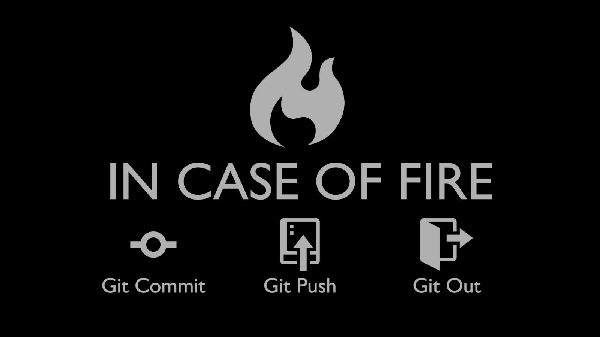

# Git&GitHub


## Que es Git ?
Git (pronunciado "guit") es un software de control de versiones diseñado por Linus Torvalds, pensando en la eficiencia y la confiabilidad del mantenimiento de versiones de aplicaciones cuando éstas tienen un gran número de archivos de código fuente.

## Que es GitHub ? 
GitHub es una plataforma de desarrollo colaborativo para alojar proyectos utilizando el sistema de control de versiones Git. Se utiliza principalmente para la creación de código fuente de programas de computadora. El software que opera GitHub fue escrito en Ruby on Rails

## Haciendo nuestro primer/N ésimo commit :3

> primero si no usas linux , instala el command line de acá [https://git-scm.com/downloads](https://git-scm.com/downloads) , luego debes hacer un fork en github del repo a modificar

- hacemos un git clone del repo a editar
para nuestro caso el __forkeado__ de nodeschool/sanmiguel

```bash
git clone https://github.com/[sancho]/sanmiguel.git
```

esto nos creara un directorio llamado "sanmiguel"
procemos a crear un nuevo archivo .yml
hacemos:

```bash
cd sanmiguel/miembros && ls

```
veremos la lista de usuarios, y su extencion .yml

- editamos el archivo __"template.yml"__

```bash
nano template.yml

```

> acá cambiamos los datos por los nuestros

para guardar los cambios presionamos __"ctrl + o"__
nos dirá:
```bash
File Name to Write: template.yml []

```
nos movilisamos hasta antes del __".yml"__
```bash
File Name to Write: template[].yml 

```

y colocamos nuetro nombre , luego presionamos __"enter"__
```bash
File Name to Write: sancho.yml 

```

denuevo nos mostrará
```bash
Save file under DIFFERENT NAME?    
```
a lo cúal tecleamos __"y"__ y isto, para salir presiona __"ctrl + x"__
> para verificar si está el archivo sancho.yml, digita en la consola __"ls"__

si todo está bien procederemos a agregar los cambios para luego hacer __commit__

### Agregando los cambios
```bash
git status   
```
nos mostrará en rojo el archivo sancho.yml ya que este no está aún en el repositorio,

continuando, antes de todo debemos verificar si hay nuevos cambios por lo cual hacemos 
```bash
git pull   
```
luego hacemos
```bash
git add sancho.yml 
```
de esta manera agregamos nuestro archivo a la configuracion __".git"__ del repositorio local

y finalmente hacemos 

```bash
git push   
```
este final agregara los cambios al repositorio remoto



# ¿Quieres más?
## Hagamos un branch

En cada confirmación de cambios (commit), Git almacena un punto de control que conserva: un apuntador a la copia puntual de los contenidos preparados (staged), unos metadatos con el autor y el mensaje explicativo, y uno o varios apuntadores a las confirmaciones (commit) que sean padres directos de esta (un padre en los casos de confirmación normal, y múltiples padres en los casos de estar confirmando una fusión (merge) de dos o mas ramas)

Una rama Git es simplemente un apuntador móvil apuntando a una de esas confirmaciones. La rama por defecto de Git es la rama master. Con la primera confirmación de cambios que realicemos, se creará esta rama principal master apuntando a dicha confirmación. En cada confirmación de cambios que realicemos, la rama irá avanzando automáticamente. Y la rama master apuntará siempre a la última confirmación realizada

### Sabiendo eso, pará que me sirve?
- La mayoria de repositorios te pide que describas que hace o un titulo especifico del cambio que quieres realizar, por razones obvias, no se agregara un push de alguien __"x"__ a diestra y siniestra, por ello antes de hacer un push para el cazo de sancho.yml, podríamos haber creado una nueva rama con el nombre __"agregando a sancho a los miembros"__ , así el que da mantenimiento al repositorio o por cuestión de __"Verzionising"__ se define para qué o qué hace dicho cambio

### Aún más?

- [https://learngitbranching.js.org/](https://learngitbranching.js.org/)

- [https://services.github.com/on-demand/downloads/github-git-cheat-sheet.pdf](https://services.github.com/on-demand/downloads/github-git-cheat-sheet.pdf)